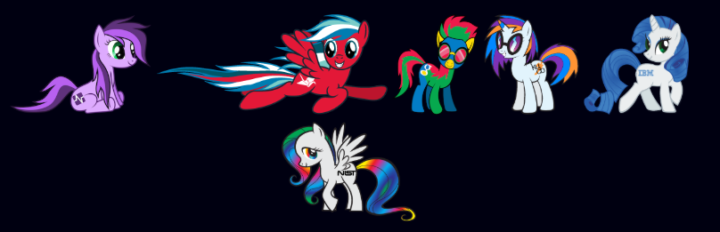

# 概述

YOLO是知名的目标检测算法，其作者是Joe Redmon。YOLO是“You Only Look Once”的缩写，这一命名一方面体现了该算法在检测速度上的优势，另一方面也致敬了乔布斯的经典名言：

> You only live once. Make it count.

作者Joe Redmon是个非常有趣的大牛，不仅YOLO系列的论文一如既往的文风飘逸，他的主页布置的也十分调皮，就像下面这样(#^.^#)，看来还是彩虹马的fans。

> 《My Little Pony（彩虹小马）》在欧美宅圈非常有名。这原本是一部面向小女孩的动画，结果令人意想不到的是，彩虹小马的形象吸引了大批中年大叔前来围观。



言归正传，我们这里测试的是YOLO v3版本，这一版本解决了之前版本中识别小物体效果差的问题。在基准测试中，YOLO v3效果拔群，与竞争对手相比目标检测更快、更准。


下面我们就来体验以下YOLO的强大威力。注意，以下的所有操作都是在Linux下进行的，在Windows下有些步骤可能有所不同。这里强烈建议使用Linux完成所有操作，因为Windows下的完成这一切可能会困难很多！

# 下载源码并编译

我们首先下载Git仓库：

```
git clone https://github.com/pjreddie/darknet
```

之后进入darknet目录，修改`Makefile：`

```
cd darknet
nano Makefile
```

如果安装了CUDA和CUDNN，可以把前两行都改成1，从而充分利用GPU的计算能力。修改Makefile后，输入以下命令进行编译：

```
make
```

在编译过程中，如果出现了以下错误：

```
gcc: error trying to exec 'cc1': execvp: No such file or directory
```

那么表明可能是编译器出现了问题，一般可以通过重新安装`build-essential`来解决：

```
sudo apt-get update
sudo apt-get install --reinstall build-essential
```

# 尝试使用YOLO进行目标检测

编译成功后，我们就可以测试YOLO算法了。在这之前需要下载预训练的权重：

```
wget https://pjreddie.com/media/files/yolov3.weights
```

下载完成后，我们就可以直接使用预训练的网络进行目标检测了：

```
./darknet detect cfg/yolov3.cfg yolov3.weights data/dog.jpg
```

这里的`cfg/yolov3.cfg`是一个预置的配置文件，`yolov3.weights`是预训练权重，而`data/dog.jpg`是预置的一张测试图片。之后我们将会看到终端输出了网络结构和三个物体的置信度。与此同时，还在darknet目录下生成了一张检测结果图片`predictions.png`。


近处的狗狗、自行车和远处的汽车都被检测到了。是不是很强大呢？

# 用VOC数据集进行训练

我们希望把YOLO用在一些通用数据集的训练上。这里以VOC数据集为例进行介绍。

## 下载数据集并生成标签

首先下载VOC数据集：

```
wget https://pjreddie.com/media/files/VOCtrainval_11-May-2012.tar
wget https://pjreddie.com/media/files/VOCtrainval_06-Nov-2007.tar
wget https://pjreddie.com/media/files/VOCtest_06-Nov-2007.tar
tar xf VOCtrainval_11-May-2012.tar
tar xf VOCtrainval_06-Nov-2007.tar
tar xf VOCtest_06-Nov-2007.tar
```

`wget`用于下载文件，而`tar xf`则是解压文件的命令。操作完成后，我们会在darknet文件夹下找到一个名为`VOCdevkit`的目录。接下来我们需要生成`.txt`文件供darknet使用。我们可以下载并运行`voc_label.py`来完成：

```
wget https://pjreddie.com/media/files/voc_label.py
python voc_label.py
```

> 如果仅下载了VOC2007或VOC2012数据集，需要适当修改`voc_label.py`文件。

之后我们把训练记录文件合并：

```
cat 2007_train.txt 2007_val.txt 2012_*.txt > train.txt
```

## 修改配置文件

我们需要适当修改`cfg/voc.data`文件：

```
  1 classes= 20
  2 train  = <path-to-voc>/train.txt
  3 valid  = <path-to-voc>2007_test.txt
  4 names = data/voc.names
  5 backup = backup
```

这里我们需要把`<path-to-voc>`替换成实际的目录。

此外，还需要修改`cfg/yolov3-voc.cfg`文件，前几行是这样的：

```
[net]
# Testing
batch=1
subdivisions=1
# Training
# batch=64
# subdivisions=16
```

我们把这几行修改为：

```
[net]
# Testing
# batch=1
# subdivisions=1
# Training
batch=64
subdivisions=64
```

注意，如果没有修改`yolov3-voc.cfg`，那么它将处于测试模式，如果用于训练，则所有的训练步骤都会出现Avg IOU: nan的情况；如果`subdivisions`设的过小，可能出现CUDA Error: out of memory的错误。

## 下载预训练网络

我们下载用Imagenet训练好的darknet53网络：

```
wget https://pjreddie.com/media/files/darknet53.conv.74
```

## 训练模型

按照YOLO的使用方法说明，在对应位置填写适当参数，就开始训练啦！

```
./darknet detector train cfg/voc.data cfg/yolov3-voc.cfg darknet53.conv.74
```

## 使用训练好的模型进行预测

如果认为训练效果比较满意了，可以随时`Ctrl + C`中断训练。在backup文件夹中保存了训练中生成的权重备份文件，我们用下面的命令就可以使用训练好的模型进行预测：

```
./darknet detect cfg/yolov3-voc.cfg backup/yolov3-voc_1000.weights data/dog.jpg
```

其中的`backup/yolov3-voc_1000.weights`可以替换成你需要测试的权重文件。

# 在自己的数据集上进行训练

我们可以参照VOC之类通用数据集的文件组织形式，构造自己的数据集，并在自己的数据集上训练目标检测模型。在自己的数据集上训练网络的步骤一般包括以下几步：

- 准备好训练、验证、测试数据
- 下载预训练网络
- 生成训练、测试集文件列表，并保存在`.txt`文件中
- 编写配置文件（`*.cfg`文件）、数据加载文件（'`*.data`文件）和分类名称列表（`*.name`文件）
- 进行训练并测试模型效果

## 准备数据

把图像及标注数据按VOC数据集的形式放在`Annotations`和`JPEGImages`文件夹中。标准训练过程还需要在`ImageSets`文件夹中指定训练、验证和测试数据，但是这里一切从简，我们假设全部数据都用于训练。

## 下载预训练网络

例如我们下载darknet53网络：

```
wget https://pjreddie.com/media/files/darknet53.conv.74
```

## 生成YOLO训练列表

YOLO要求必须指定训练、测试文件列表并存放在`.txt`文件中。我们可以修改之前的`voc_label.py`文件，这里需要注意一下几点：

1. VOC数据集是按照年份、训练、测试和验证集分成不同文件夹存储的，我们只有一个数据集且不指定验证和测试数据，不需要按年份和数据集类型遍历；

2. 类别一般不需要指定

3. 文件存放的目录需按自己的实际情况指定

4. 如果我们把所有图片都当成训练数据，只需要遍历存放图片的文件夹获取所有文件名存储到`train.txt`文件即可，可按以下方式修改：

   ```python
   image_ids = os.listdir('<Your path>/JPEGImages')
   image_ids = [x.split('.')[0] for x in image_ids]
   ```

## 编写配置文件

如果我们按VOC数据集的形式组织数据，那么只需要基于VOC相关配置文件进行修改就可以了。需要修改的文件有以下三个：

- `cfg/yolov3-voc.cfg`：超参数和网络结构信息，这里我们需要把Testing的两条配置注释掉，而把Training的两条配置取消注释，并根据自己显存的大小修改`subdivisions`参数；`max_batches`规定了训练多少个batch后结束，按需修改即可；[yolo]层的分类数量改成自己的数据集的分类数量，[yolo]层之前的卷积层要修改卷积核大小，按以下公式计算：
  $$
  size = channels \times (1 + 4 + classes)
  $$
  注意YOLO v3版有3个[yolo]层，要分别进行修改。

- `cfg/voc.data`：指定分类数量，训练集文件列表，测试集文件列表，各类名称和备份目录。

- `data/voc.names`：分类名称的列表，按自己的数据集修改即可。

## 进行训练并测试效果

参考之前VOC数据集的操作，注意把配置文件名改成自己的配置文件。由于实际情况千差万别，这里不具体展开了。

# 进一步探索

以上内容简单介绍了如何安装、运行YOLO v3目标检测算法，以及如何将其用于训练自己的数据集。但是有一些关键的问题我们还没有涉及：

- **训练集、验证集、测试集的划分**：这对于模型的训练效果十分重要，而目前网络上的各种资料一般都对这个问题避而不谈，我们将在以后具体讨论这个问题。
- **调节参数**：各种参数对神经网络的训练效果影响很大，默认的参数虽然在通用数据集上效果不错，但是对于特定领域的目标检测问题并不能取得最佳效果。调参是一件费时费力的工作，一般而言，准备数据、搭建模型和训练模型的工作量仅占10%左右，90%的时间算法工程师都在调参。这也是深度学习被戏称为“炼丹”的原因。
- **训练过程监测**：TensorBoard、Visdom等工具可以用于实时可视化训练的过程，我们会在后面的例子中介绍。
