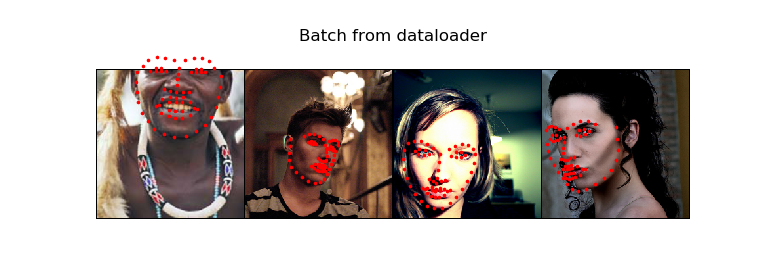

# 概述

在机器学习任务中，需要花费大量工作用于准备数据。PyTorch提供了许多工具用来加载数据。本节将简述处理、变换数据的方法。需先安装以下模块以完成剩余部分的内容：

- `scikit-image`：图像IO及变换
- `pandas`：用于解析csv格式数据

首先加载必要的模块：

```python
import os
import torch
import pandas as pd
from skimage import io, transform
import numpy as np
import matplotlib.pyplot as plt
from torch.utils.data import Dataset, DataLoader
from torchvision import transforms, utils

import warnings
warnings.filterwarnings("ignore")  # 忽略所有警告信息

plt.ion()  # 交互模式
```

我们将加载面部姿势的数据。在这个数据集中，脸部图片将会有68个不同的特征点被标记。

> 数据集的下载地址：https://download.pytorch.org/tutorial/faces.zip。该数据集是使用dlib's pose estimation（http://blog.dlib.net/2014/08/real-time-face-pose-estimation.html）生成的。

数据集中的csv文件记录了每张人脸图片68个特征标记点（landmark points）的位置信息。我们可以使用pandas来加载它，并尝试解析数据：

```python
landmarks_frame = pd.read_csv('faces/face_landmarks.csv')

n = 65  # 这里我们解析第65张图片
img_name = landmarks_frame.iloc[n, 0]  # 第一列是图片文件名
landmarks = landmarks_frame.iloc[n, 1:].as_matrix()  # 之后各列是特征点位置坐标
landmarks = landmarks.astype('float').reshape(-1, 2)  # 变换为68行、2列的矩阵（每行为x,y）

print('Image name: {}'.format(img_name))
print('Landmarks shape: {}'.format(landmarks.shape))
print('First 4 Landmarks: {}'.format(landmarks[:4]))
```

我们可以写一个简单的辅助函数来展示图片和特征标记点：

```python
def show_landmarks(image, landmarks):
    """查看图片和特征标记点"""
    plt.imshow(image)
    plt.scatter(landmarks[:, 0], landmarks[:, 1], s=10, marker='.', c='r')
    plt.pause(0.001)
plt.figure()
show_landmarks(io.imread(os.path.join('faces/', img_name)), landmarks)  # 查看之前使用的的第65张图片
plt.show()
```


# Dataset类

`torch.utils.data.Dataset`是表示数据集的抽象类。训练时使用的数据集需要继承`Dataset`类并重写以下方法：

- `__len__`：使`len(dataset)`能正确返回数据集的大小
- `__getitem__`：使`dataset[i]`等索引方法能够正确获取相应对象

我们为人脸特征点数据集创建一个dataset类，在`__init__`方法中读取csv文件，在`__getitem__`方法中读取图片。数据集中的每个样本是一个字典：`{'image': image, 'landmarks': landmarks}`。数据集将包括一个可选参数`transform`使得任何需要进行的处理过程能够应用在样本上。

```python
class FaceLandmarksDataset(Dataset):
    """人脸特征点数据集"""
    def __init__(self, csv_file, root_dir, transform=None):
        self.landmarks_frame = pd.read_csv(csv_file)
        self.root_dir = root_dir
        self.transform = transform

    def __len__(self):
        return len(self.landmarks_frame)

    def __getitem__(self, idx):
        img_name = os.path.join(self.root_dir, self.landmarks_frame.iloc[idx, 0])
        image = io.imread(img_name)  # 读取图片
        landmarks = self.landmarks_frame.iloc[idx, 1:].as_matrix()  # 读取面部特征点信息
        landmarks = landmarks.astype('float').reshape(-1, 2)
        sample = {'image': image, 'landmarks': landmarks}  # 生成样本
        if self.transform:
            sample = self.transform(sample)  # 变换
        return sample
```

我们将其实例化并测试：

```python
face_dataset = FaceLandmarksDataset(csv_file='faces/face_landmarks.csv', root_dir='faces/')
fig = plt.figure()
for i in range(len(face_dataset)):
    sample = face_dataset[i]
    print(i, sample['image'].shape, sample['landmarks'].shape)
    ax = plt.subplot(1, 4, i + 1)
    plt.tight_layout()
    ax.set_title('Sample #{}'.format(i))
    ax.axis('off')
    show_landmarks(**sample)  # 一个星号用于解包tuple，两个星号用于解包dict

    if i == 3:  # 显示4张图片
        plt.show()
        break
```


# Transforms

容易发现，面临一个最大的问题是样本图片的尺寸时不同的。大多数的神经网络模型需要接收固定尺寸的图像作为输入，因此，我们需要编写一些方法来处理图片。这些方法包括：

- `Rescale`：改变图像尺寸
- `RandomCrop`：随机裁剪图像（用于数据增强）
- `ToTensor`：将NumPy图像转换为torch图像（需要交换坐标轴）

为了使用方便，我们编写可调用的类而不是简单的函数。我们需要实现`__call__`方法以及`__init__`方法。可以使用简单的方法调用：

```python
tsfm = Transform(params)  # 初始化时指定一些参数，以后使用可以直接调用
transformed_sample = tsfm(sample)
```

在以下代码中，图片和特征点坐标都能够得到适当的变换：

```python
class Rescale(object):
    """修改图像尺寸"""
    def __init__(self, output_size):
        assert isinstance(output_size, (int, tuple))  # 声明output_size必需是整数或者tuple
        self.output_size = output_size

    def __call__(self, sample):  # 使类的实例可调用
        image, landmarks = sample['image'], sample['landmarks']
        h, w = image.shape[:2]  # 取出前两个维度(height, width)
        if isinstance(self.output_size, int):  # 如果是整数，那么图像短边将修正为该值，且保持长宽比
            if h > w:
                new_h, new_w = self.output_size * h / w, self.output_size
            else:
                new_h, new_w = self.output_size, self.output_size * w / h
        else:  # 如果是tuple，那么匹配该tuple
            new_h, new_w = self.output_size
        new_h, new_w = int(new_h), int(new_w)  # 取整
        img = transform.resize(image, (new_h, new_w))  # 调整图像大小
        landmarks = landmarks * [new_w / w, new_h / h]  # 调整特征点坐标值
        return {'image': img, 'landmarks': landmarks}

class RandomCrop(object):
    """随机裁剪图像"""
    def __init__(self, output_size):
        assert isinstance(output_size, (int, tuple))  # 声明output_size必需是整数或者tuple
        if isinstance(output_size, int):  # 如果是整数，则长宽相等
            self.output_size = (output_size, output_size)
        else:  # 如果是tuple，则匹配该tuple
            assert len(output_size) == 2
            self.output_size = output_size

    def __call__(self, sample):  # 使类的实例可调用
        image, landmarks = sample['image'], sample['landmarks']
        h, w = image.shape[:2]
        new_h, new_w = self.output_size
        top = np.random.randint(0, h - new_h)  # 随机取左上角点的h坐标
        left = np.random.randint(0, w - new_w)  # 随机取左上角点的w坐标
        image = image[top: top + new_h, left: left + new_w]  # 截取图像的一个区域
        landmarks = landmarks - [left, top]  # 调整特征点坐标
        return {'image': image, 'landmarks': landmarks}

class ToTensor(object):
    """转换ndarray为Tensor"""
    def __call__(self, sample):
        image, landmarks = sample['image'], sample['landmarks']
        # numpy image: H x W x C; torch image: C x H x W (numpy is color-last while torch is color-first)
        image = image.transpose((2, 0, 1))
        return {'image': torch.from_numpy(image),
                'landmarks': torch.from_numpy(landmarks)}
```

现在，我们对样本应用变换。我们希望把图像的短边调整为256像素，并随机在图像上裁剪一个边长为224像素的正方形，也就是说，我们希望`Rescale`和`RandomCrop`图像。如果我们想同时对图像进行多种变换，可以使用`torchvision.transforms.Compose`：

```python
scale = Rescale(256)
crop = RandomCrop(128)
composed = transforms.Compose([Rescale(256), RandomCrop(224)])

fig = plt.figure()
sample = face_dataset[65]
for i, tsfrm in enumerate([scale, crop, composed]):  # 进行三种不同的变换并查看效果
    transformed_sample = tsfrm(sample)  # 进行变换
    ax = plt.subplot(1, 3, i + 1)
    plt.tight_layout()
    ax.set_title(type(tsfrm).__name__)  # __name__记录了类的名称
    show_landmarks(**transformed_sample)  # 两个型号表示解析字典作为参数
plt.show()
```


# 处理整个数据集

接下来，我们创建一个数据集，并进行多种变换以及数据增强。可以使用`for`循环遍历整个数据集：

```python
transformed_dataset = FaceLandmarksDataset(csv_file='faces/face_landmarks.csv',
                                        root_dir='faces/',
                                        transform=transforms.Compose([
                                            Rescale(256),
                                            RandomCrop(224),
                                            ToTensor()
                                        ]))  # 创建Dataset并指定变换类型
for i in range(len(transformed_dataset)):
    sample = transformed_dataset[i]
    print(i, sample['image'].size(), sample['landmarks'].size())
    if i == 3:  # 试读取前4张图片
        break
```

然而，使用`for`循环进行遍历失去了一下特性：

- 数据批处理(batching)
- 数据顺序随机化(shuffling)
- 并行加载数据（使用`multiprocessing`）

`torch.utils.data.DataLoader`是PyTorch提供的迭代器，可以实现以上特性。我们可以通过`collate_fn`来指定数据批处理的方法，不过默认的方式已经可以应对大多数应用场景。

```python
# 创建一个数据加载器，能够按batch加载图像、洗牌以及多进程工作
dataloader = DataLoader(transformed_dataset, batch_size=4, shuffle=True, num_workers=4)

# 辅助函数，用于展示batch
def show_landmarks_batch(sample_batched):
    """对于一个batch的样本，展示图像和特征点"""
    images_batch, landmarks_batch = sample_batched['image'], sample_batched['landmarks']
    batch_size = len(images_batch)
    im_size = images_batch.size(2)

    grid = utils.make_grid(images_batch)  # 将多张图合并成一张大图
    plt.imshow(grid.numpy().transpose((1, 2, 0)))  # 绘制一个batch的图片

    for i in range(batch_size):  # 绘制特征点
        plt.scatter(landmarks_batch[i, :, 0].numpy() + i * im_size,
                    landmarks_batch[i, :, 1].numpy(),
                    s=10, marker='.', c='r')
        plt.title('Batch from dataloader')

from torch.multiprocessing import freeze_support  # 在Windows下必须加上该语句
if __name__ == '__main__':
    freeze_support()  # 在Windows下必须加上该语句
    for i_batch, sample_batched in enumerate(dataloader):
        print(i_batch, sample_batched['image'].size(),
              sample_batched['landmarks'].size())
        # 显示第四个batch并停止
        if i_batch == 3:
            plt.figure()
            show_landmarks_batch(sample_batched)
            plt.axis('off')
            plt.ioff()
            plt.show()
            break
```



# 使用torchvision自带模块

在本节中，我们使用dataset、dataloader来组织和加载数据，并对图像进行变换。`torchvision`模块提供了一些常用dataset和transform的方法。一个更加常用的dataset是`ImageFolder`，它假设图像按照类别标签放在了不同文件夹中。类似的，一些针对`PIL.Image`的通用变换，例如`RandomHorizontalFlip`和`Scale`都已经内置，例如：

```python
import torch
from torchvision import transforms, datasets

data_transform = transforms.Compose([
    transforms.RandomSizeCrop(224),  # 内置的变换方法
    transforms.RandomHorizontalFlip(),
    transforms.ToTensor(),
    transforms.Normalize(mean=[0.485, 0.456, 0.406],
                         std=[0.229, 0.224, 0.225])
])
hymenoptera_dataset = datasets.ImageFolder(root='hymenoptera_data/train',
                                           transform=data_transform)  # ImageFolder数据集
dataset_loader = torch.utils.data.DataLoader(hymenoptera_dataset,
                                             batch_size=4, shuffle=True,
                                             num_workers=4)
```
