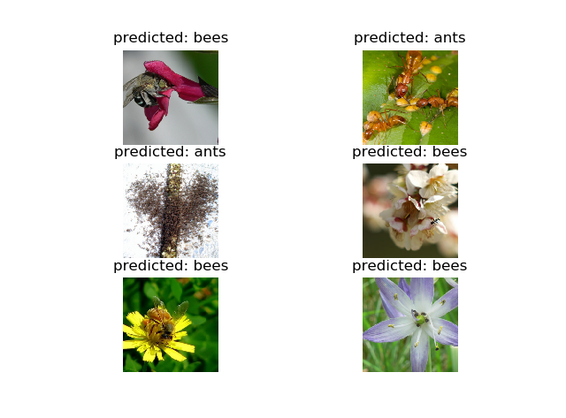

# 概述

本节介绍如何使用迁移学习的方法训练神经网络。

> 阅读CS231n讲义以了解更多迁移学习相关知识：http://cs231n.github.io/transfer-learning/

两个迁移学习的主要应用场景分别是：

- 神经网络的微调：与随机初始化不同，我们用预训练网络来进行初始化，例如预训练ImageNet，其他操作与普通的神经网络别无二致；
- 将神经网络作为固定特征的提取器：我们冻结与网络的所有权重，除了最后的全连接层，全连接层被替换为了一个新的、随机初始化权重的层，仅对该层进行训练。

我们首先导入必要的模块：

```python
import torch
import torch.nn as nn
import torch.optim as optim
from torch.optim import lr_scheduler  # 用于学习率随训练的进行而变化
import numpy as np
import torchvision
from torchvision import datasets, models, transforms
import matplotlib.pyplot as plt
import time
import os
import copy
from torch.multiprocessing import freeze_support  # Windows操作系统应加上此句

plt.ion()  # 交互模式
```

# 加载数据

如上节所述，我们采用`torchvision`和`torch.utils.data`组件来加载数据。我们将训练一个模型用于蚂蚁和蜜蜂的分类。现有120张训练图片，75张验证图片。这是非常小的一个数据集，如果从头开始训练网络很难取得理想的训练效果。因此我们采用迁移学习的方法，借助神经网络的泛化能力来进行训练。

> 下载数据集：https://download.pytorch.org/tutorial/hymenoptera_data.zip

以下代码用于定义数据的transforms、datasets以及dataloaders。同时我们尝试使用GPU进行将训练。

```python
data_transforms = {
    'train': transforms.Compose([
        transforms.RandomResizedCrop(224),
        transforms.RandomHorizontalFlip(),  # 随机水平翻转（概率0.5）
        transforms.ToTensor(),
        transforms.Normalize([0.485, 0.456, 0.406], [0.229, 0.224, 0.225])
    ]),
    'val': transforms.Compose([
        transforms.Resize(256),
        transforms.CenterCrop(224),
        transforms.ToTensor(),
        transforms.Normalize([0.485, 0.456, 0.406], [0.229, 0.224, 0.225])
    ])
}  # 进行数据增强和正则化
data_dir = 'hymenoptera_data'
image_datasets = {x: datasets.ImageFolder(os.path.join(data_dir, x),
                                          data_transforms[x])
                  for x in ['train', 'val']}  # 字典推导，定义了训练集和测试集
dataloaders = {x: torch.utils.data.DataLoader(image_datasets[x], batch_size=4,
                                              shuffle=True, num_workers=4)
               for x in ['train', 'val']}  # 字典推导，定义了训练集和测试集的数据加载器
dataset_sizes = {x: len(image_datasets[x]) for x in ['train', 'val']}
class_names = image_datasets['train'].classes

device = torch.device("cuda:0" if torch.cuda.is_available() else "cpu")  # 尝试使用GPU
```

接下来，我们尝试可视化部分训练图片，并查看数据增强的情况：

```python
def imshow(inp, title=None):
    """对Tensor进行可视化"""
    inp = inp.numpy().transpose((1, 2, 0))  # 注意，numpy和Tensor的色彩维度位置不同
    mean = np.array([0.485, 0.456, 0.406])
    std = np.array([0.229, 0.224, 0.225])
    inp = std * inp + mean
    inp = np.clip(inp, 0, 1)  # 把值限定在0和1之间
    plt.imshow(inp)
    if title is not None:
        plt.title(title)
    plt.pause(0.001)

if __name__ == "__main__":
    freeze_support()  # Windows操作系统必需加上此句
    inputs, classes = next(iter(dataloaders['train']))  # dataloaders采用迭代器的方式使用
    out = torchvision.utils.make_grid(inputs)  # 多张图合并成一张大图
    imshow(out, title=[class_names[x] for x in classes])
    plt.show()
```


# 训练模型

我们编写一个通用函数用于训练模型。这里介绍两种常见技巧：

- 在训练过程中调整学习率
- 保存最佳模型

参数`scheduler`是一个LR scheduler对象，其来自于`torch.optim.lr_scheduler`。

```python
def train_model(model, criterion, optimizer, scheduler, num_epochs=25):
    since = time.time()
    best_model_wts = copy.deepcopy(model.state_dict())  # model.state_dict()存储着权重
    best_acc = 0.0
    for epoch in range(num_epochs):
        print('Epoch {}/{}'.format(epoch, num_epochs - 1))
        print('-' * 10)

        # 每个epoch都有一个训练阶段和一个验证阶段
        for phase in ['train', 'val']:
            if phase == 'train':
                scheduler.step()
                model.train()  # 训练模式
            else:
                model.eval()  # 评估模式
            running_loss = 0.0
            running_corrects = 0

            for inputs, labels in dataloaders[phase]:
                inputs = inputs.to(device)  # 将数据载入GPU
                labels = labels.to(device)
                optimizer.zero_grad()  # 将梯度置零

                # 前向传播
                # 仅训练阶段设置为可学习
                with torch.set_grad_enabled(phase == 'train'):
                    outputs = model(inputs)
                    _, preds = torch.max(outputs, 1)
                    loss = criterion(outputs, labels)
                    # 反向传播和优化（仅训练阶段）
                    if phase == 'train':
                        loss.backward()
                        optimizer.step()
                # 统计量
                running_loss += loss.item() * inputs.size(0)
                running_corrects += torch.sum(preds == labels.data)

            # 统计整个epoch的loss和acc
            epoch_loss = running_loss / dataset_sizes[phase]  # epoch的平均损失
            epoch_acc = running_corrects.double() / dataset_sizes[phase]  # epoch的平均精度
            print('{} Loss: {:.4f} Acc: {:.4f}'.format(phase, epoch_loss, epoch_acc))

            # 如果模型精度得到提高，保存模型参数
            if phase == 'val' and epoch_acc > best_acc:
                best_acc = epoch_acc
                best_model_wts = copy.deepcopy(model.state_dict())
        print()
    time_elapsed = time.time() - since  # 统计运行时间
    print('Training complete in {:.0f}m {:.0f}s'.format(
        time_elapsed // 60, time_elapsed % 60))
    print('Best val Acc: {:4f}'.format(best_acc))

    # 加载效果最好的模型并返回
    model.load_state_dict(best_model_wts)
    return model                
```

我们编写一个函数可视化模型预测结果：

```python
def visualize_model(model, num_images=6):
    was_training = model.training
    model.eval()
    images_so_far = 0
    fig = plt.figure()
    with torch.no_grad():  # 不可学习模式，用于模型测试
        for i, (inputs, labels) in enumerate(dataloaders['val']):  # 测试集数据
            inputs = inputs.to(device)  # 将数据载入GPU
            labels = labels.to(device)
            outputs = model(inputs)  # 模型输出结果
            _, preds = torch.max(outputs, 1)  # 给出预测结果

            for j in range(inputs.size()[0]):
                images_so_far += 1
                ax = plt.subplot(num_images // 2, 2, images_so_far)
                ax.axis('off')
                ax.set_title('predicted: {}'.format(class_names[preds[j]]))
                imshow(inputs.cpu().data[j])

                if images_so_far == num_images:
                    model.train(mode=was_training)
                    plt.show()
                    return
        model.train(mode=was_training)
```

# 加载预训练模型并进行迁移学习

我们加载预训练模型，并且重置最后一个全连接层：

```python
model_ft = models.resnet18(pretrained=True)  # 加载resnet18模型
num_ftrs = model_ft.fc.in_features  # 输入单元数量
model_ft.fc = nn.Linear(num_ftrs, 2)  # 输入单元数量不变，输出单元数量改为2（重置全连接层）
model_ft = model_ft.to(device)  # 载入GPU

criterion = nn.CrossEntropyLoss()

# 所有参数都将被优化
optimizer_ft = optim.SGD(model_ft.parameters(), lr=0.001, momentum=0.9)

# 学习率每7个epoch衰减一次，衰减系数为0.1
exp_lr_scheduler = lr_scheduler.StepLR(optimizer_ft, step_size=7, gamma=0.1)
```

开始训练：

```python
model_ft = train_model(model_ft, criterion, optimizer_ft, exp_lr_scheduler, num_epochs=25)
```

如果在CPU上训练，需要花费15-25分钟；在GPU上仅需花费1分钟左右。

可视化模型预测效果：

```python
visualize_model(model_ft)
```



# 将神经网络作为特征提取器

要将训练好的网络作为特征提取器，需要先冻结网络，除了最后一层。我们需要设置`requires_grad == False`来冻结参数，使梯度不能在`backward()`中计算。

> 参考PyTorch文档：https://pytorch.org/docs/master/notes/autograd.html

```python
model_conv = torchvision.models.resnet18(pretrained=True)
for param in model_conv.parameters():
    param.requires_grad = False  # 不自动求导
num_ftrs = model_conv.fc.in_features  # 输入单元数量
model_conv.fc = nn.Linear(num_ftrs, 2)  # 设置输出单元数量为2，新建的模块默认requires_grad=True
model_conv = model_conv.to(device)
criterion = nn.CrossEntropyLoss()
optimizer_conv = optim.SGD(model_conv.fc.parameters(), lr=0.001, momentum=0.9)
exp_lr_scheduler = lr_scheduler.StepLR(optimizer_conv, step_size=7, gamma=0.1)
```

如果只训练最后一个全连接层，训练时间大致为上一个场景的一半左右：

```python
model_conv = train_model(model_conv, criterion, optimizer_conv, exp_lr_scheduler, num_epochs=25)
visualize_model(model_conv)
plt.ioff()  # 关闭交互模式
plt.show()
```

训练完成后，模型可以达到与上一个场景类似的精度。
