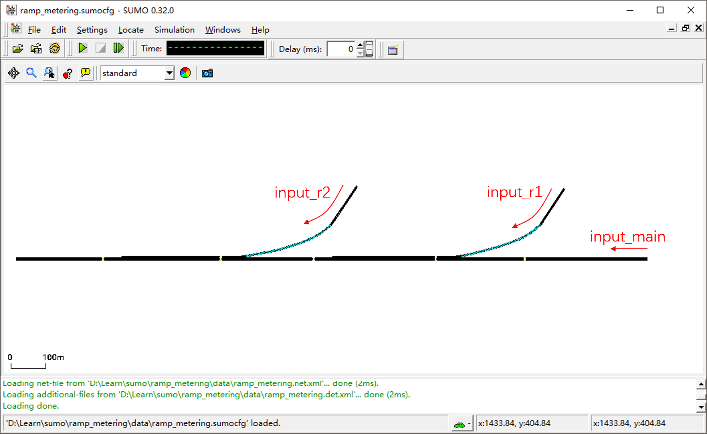
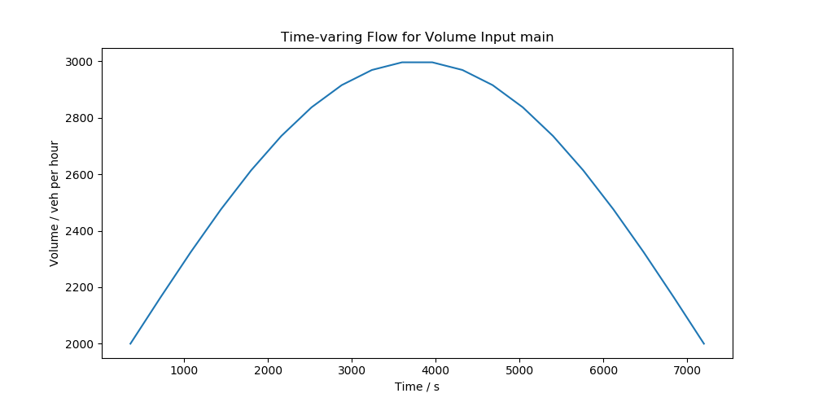

# 概述
在现实世界的路网中，交通需求是随时间变化的，应对这种交通流的“潮汐”现象也是交通规划和设计面临的一大挑战。本节介绍如何为仿真场景提供变化的流量输入，使仿真更加贴近实际应用。

# 建立路网
使用SUMO路网编辑器建立一段快速路路网，包括主线和两个入口匝道。路网的形式如下图所示。注意根据所绘制路网的实际情况修改匝道与主线车道的连通性。匝道和主线分别接一小段路作为流量输入的起点（例如下图的input_main、input_r1、input_r2）。



# 通过路由文件定义流量输入
SUMO的流量输入是通过路由文件`*.rou.xml`定义的。路由文件支持多种形式的流量输入，我们可以为每辆车指定所要经过的道路，也可以定义“重复性输入”，即`flow`。一个典型的`flow`定义如下：
```xml
<flow id="main" begin="0" end="3600" from="input_main" to="edge5" type="car" vehsPerHour="2500" departLane="random"/>
```
各参数的含义如下：
* `id`：流量输入的命名；
* `begin`：起始时间；
* `end`：结束时间；
* `from`：起始路段；
* `end`：结束路段；
* `type`：车辆类型；
* `vehsPerHour`：小时流量；
* `departLane`：起始位置的车道。

注意，这里并没有为车辆定义完整路径，而是只定义了起始和结束路段，车辆的运行轨迹将按最短路径原则自动分配。

# 自动生成随时间变化的流量
显然，我们只要为不同的时间段定义不同的`flow`即可实现随时间变化的流量输入。为了简化工作流程，可以采用编码的方式读写`*.rou.xml`路由文件。

## XML辅助类
使用Python的`xml`模块可以方便地读写和编辑XML文件。首先导入模块：
```python
from xml.etree.ElementTree import ElementTree, Element
```
我们建立一个`XMLHelper`辅助类来方便后续处理：
```python
class XMLHelper(object):
    @staticmethod
    def readXML(file):
        """Read XML file"""
        tree = ElementTree()
        tree.parse(file)
        return tree

    @staticmethod
    def writeXML(tree, out_path):
        """Write XML file"""
        tree.write(out_path, encoding="utf-8", xml_declaration=False)

    @staticmethod
    def create_node(tag, property_map):
        """Create a node"""
        element = Element(tag, property_map)
        return element

    @staticmethod
    def add_child_node(parent_node, element):
        """Add a child node"""
        parent_node.append(element)

    @staticmethod
    def del_nodes(parent_node, tag):
        """Delete a node"""
        for child in parent_node.getchildren():
            if child.tag == tag:
                parent_node.remove(child)
```

## Route辅助类
在XML辅助类的基础上，进一步地，我们需要根据路由文件的定义，建立一个Route辅助类`RouteHelper`，以便写入`flow`定义。
```python
class RouteHelper(object):

    def __init__(self, file):
        self.XMLTree = XMLHelper.readXML(file)

    def addFlow(self, flowDictList):
        """Add flow definition"""
        for i in range(len(flowDictList)):
            node = XMLHelper.create_node("flow", flowDictList[i])
            XMLHelper.add_child_node(self.XMLTree.getroot(), node)

    def removeAll(self):
        """Remove all nodes about flow definition"""
        XMLHelper.del_nodes(self.XMLTree.getroot(), "flow")
```
这里我们建立了一个`addFlow`方法，其输入是一个`flow`定义字典的列表。而`removeAll`方法用于移除已经定义的所有`flow`。
接下来考虑如何定义时变流量。如果有现实路网的观测数据，我们可以直接将真实的流量观测值作为输入，但大多数情况下我们只能通过创造虚拟的时变数据完成仿真评估任务。使用三角函数来生成变化的流量是一种最常采用的方法，我们编写`createSinFlow`生成正弦波形的时变流量：
```python
def createSinFlow(self, id_prefix, vType, from_edge, to_edge, begin_time, end_time, time_slot, min_volume, max_volume):
    """Create time-varing flow"""
    time_slots = np.linspace(begin_time, end_time, time_slot + 1)
    angles = np.linspace(0, 180, time_slot)
    volume_list = []
    for i in range(len(time_slots) - 1):
        volume_list.append(min_volume + (max_volume - min_volume) * np.sin(angles[i] * np.pi / 180))
    flowDictList = []
    for i in range(len(time_slots) - 1):
        flowDictList.append({'id': id_prefix+str(i),
                             'type': vType,
                             'from': from_edge,
                             'to': to_edge,
                             'begin': str(int(time_slots[i])),
                             'end': str(int(time_slots[i+1])),
                             'vehsPerHour': str(int(volume_list[i])),
                             'departLane': 'random'
                             })
    self.addFlow(flowDictList)
```
一个调用的例子如下：
```python
createSinFlow('main', 'car', "input_main", "edge5", 0, 7200, 20, 2000, 3000)
```
该调用的含义是，生成一个id前缀为`main`，车辆类型为`car`，起始路段为`input_main`，结束路段为`edge5`的`flow`，时间范围从0s到7200s，共划分为20个时间段，最小流量值为2000veh/h，最大流量值为3000veh/h。该定义得到的流量时变图如下：



当有不同的流量输入起点时，只需多次调用该方法即可。注意为不同起点的`flow`分配不同的id前缀。

最后，需要编写`writeXML`方法，用于将`flow`定义写入`*.rou.xml`路由定义文件：
```python
def writeXML(self, file):
    """Order by begin time and write XML file"""
    nodeList = self.XMLTree.getroot().getchildren()[1:]
    for i in range(len(nodeList) - 1):
        for j in range(len(nodeList) - i - 1):
            if int(nodeList[j].get('begin')) > int(nodeList[j + 1].get('begin')):
                nodeList[j], nodeList[j + 1] = nodeList[j + 1], nodeList[j]
    XMLHelper.del_nodes(self.XMLTree.getroot(), "flow")
    for i in range(len(nodeList)):
        XMLHelper.add_child_node(self.XMLTree.getroot(), nodeList[i])
    XMLHelper.writeXML(self.XMLTree, file)
```
官方文档未说明的一点时，只有当`begin`（即开始时间）正序排列时`flow`定义才能被SUMO正常读取。因此，在写入XML文件之前，添加了按开始时间排序的处理流程。

# 通过TraCI调用SUMO仿真
在Python主程序中，我们先定义一个`rh`Route辅助对象，移除所有已定义的流量输入，之后为三个起点定义时变流量，之后写入路由文件中。
```python
rh = RouteHelper('data/ramp_metering.rou.xml')
rh.removeAll()
rh.createSinFlow('main', 'car', "input_main", "edge5", 0, 7200, 20, 2000, 3000)
rh.createSinFlow('ramp1', 'car', "input_ramp1", "edge5", 0, 7200, 20, 1000, 1500)
rh.createSinFlow('ramp2', 'car', "input_ramp2", "edge5", 0, 7200, 20, 1000, 1500)
rh.writeXML("data/ramp_metering.rou.xml")
```
编写`ramp_metering.sumocfg`文件，并用下列语句调用SUMO进行仿真：
```python
traci.start([sumoBinary, "-c", "data/ramp_metering.sumocfg", "-S", "-Q"])
```
其中`-S`和`-Q`的含义是自动开始仿真和结束仿真。
（完整代码将很快放出）
