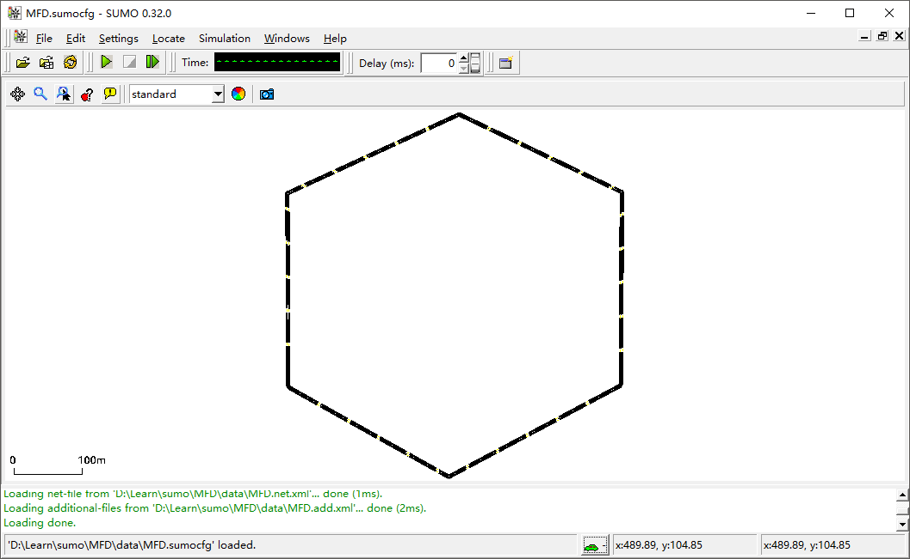
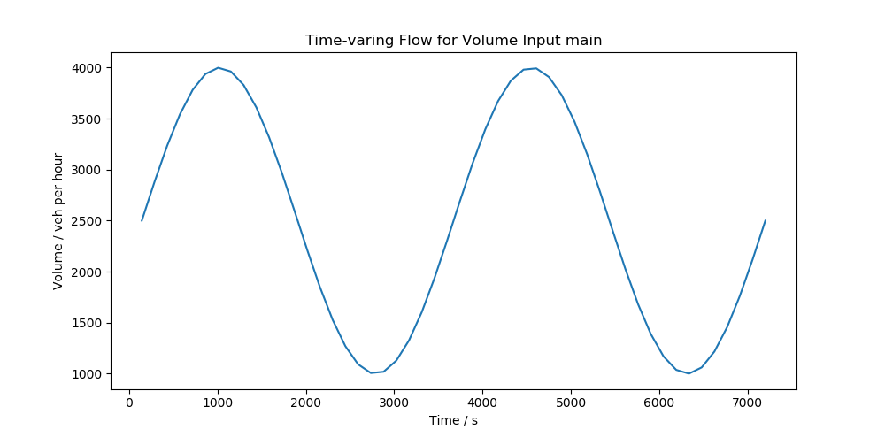
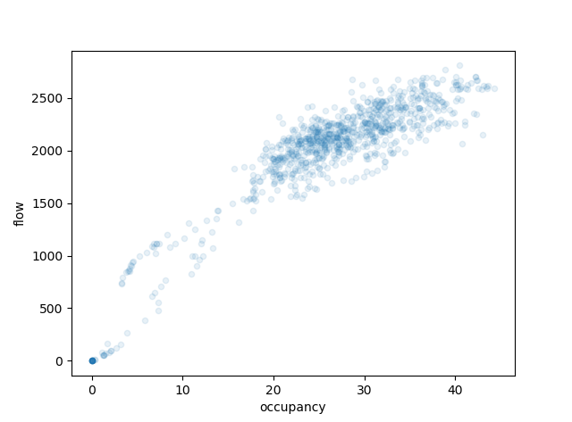

# 概述
本节介绍如何解析检测线圈的输出数据文件，并进行相应的分析工作。

# 建立路网
用路网编辑器建立一个六边形的环形路网，每条边长度约500米，单侧双车道，如下图所示。



# 设置检测线圈
建立文件`MFD.add.xml`，写入以下内容：
```xml
<additionals>
	<inductionLoop id="D01_0" lane="edge1_0" pos="50" freq="300" file="MFD.out" friendlyPos="x"/>
	<inductionLoop id="D02_0" lane="edge1_0" pos="100" freq="300" file="MFD.out" friendlyPos="x"/>
	...
	<inductionLoop id="D01_1" lane="edge1_1" pos="50" freq="300" file="MFD.out" friendlyPos="x"/>
	<inductionLoop id="D02_1" lane="edge1_1" pos="100" freq="300" file="MFD.out" friendlyPos="x"/>
	...
</additionals>
```
以上信息，定义了每隔约50米在两条车道上设置检测线圈，并指定检测线圈的数据汇总频率为300秒（5分钟），检测线圈的检测数据将输出到`MFD.out`文件中。

# 定义路由
我们用与上一节类似的方法，定义随时间变化的流量输入。建立文件`MFD.rou.xml`，并写入车辆类型定义信息：
```xml
<vType accel="2.6" decel="4.5" id="car" lcCooperative="0.5" lcImpatience="0.5" length="4.5" maxSpeed="22.3" minGap="1.5" sigma="0.25" speedDev="3" vClass="passenger" />
```
在上一节中，我们建立了路由辅助类`RouteHelper`，并定义方法`createSinFlow`来创建随时间变化的流量定义：
```python
def createSinFlow(self, id_prefix, vType, from_edge, to_edge, begin_time, end_time, time_slot, min_volume, max_volume):
    """Create time-varing flow"""
    time_slots = np.linspace(begin_time, end_time, time_slot + 1)
    angles = np.linspace(0, 180, time_slot)
    volume_list = []
    for i in range(len(time_slots) - 1):
        volume_list.append(min_volume + (max_volume - min_volume) * np.sin(angles[i] * np.pi / 180))
    flowDictList = []
    for i in range(len(time_slots) - 1):
        flowDictList.append({'id': id_prefix+str(i),
                             'type': vType,
                             'from': from_edge,
                             'to': to_edge,
                             'begin': str(int(time_slots[i])),
                             'end': str(int(time_slots[i+1])),
                             'vehsPerHour': str(int(volume_list[i])),
                             'departLane': 'random'
                             })
    self.addFlow(flowDictList)
```
该方法只能创建半个周期的正弦波形式的时变流量。我们增强其功能，使其可以创建任意波形的流量：
```python
def createSinFlow(self, id_prefix, vType, from_edge, to_edge, begin_time, end_time, time_slot, periods, begin_period, min_volume, max_volume):
    time_slots = np.linspace(begin_time, end_time, time_slot + 1)
    angles = np.linspace(360 * begin_period, 360 * begin_period + 360 * periods, time_slot)
    volume_list = []
    for i in range(len(time_slots) - 1):
        volume_list.append((max_volume - min_volume) / 2 + min_volume
                           + ((max_volume - min_volume) / 2) * np.sin(angles[i] * np.pi / 180))
    flowDictList = []
    for i in range(len(time_slots) - 1):
        flowDictList.append({'id': id_prefix+str(i),
                             'type': vType,
                             'from': from_edge,
                             'to': to_edge,
                             'begin': str(int(time_slots[i])),
                             'end': str(int(time_slots[i+1])),
                             'vehsPerHour': str(int(volume_list[i])),
                             'departLane': 'random'
                             })
    self.addFlow(flowDictList)
```
在新的`createSinFlow`方法中，增加了`periods`和`begin_period`参数，用于指定波形的周期数和开始位置，例如`periods=1`和`begin_period=0.25`可以创建从正弦波的1/4周期开始，1个周期结束的波形。但是注意，新的`createSinFlow`方法的`min_volume`和`max_volume`是指完整正弦波形的波谷和波峰值，而不是实际定义波形的波谷和波峰值。

我们进行以下流量定义：
```python
rh.createSinFlow('main', 'car', "edge1", "edge3", 0, 7200, 50, 2, 0, 1000, 4000)
```

流量波形如下图所示：


# 编写仿真配置文件并运行仿真
建立文件`MFD.sumocfg`，并写入以下内容：
```xml
<configuration>
   <input>
       <net-file value="MFD.net.xml"/>
       <route-files value="MFD.rou.xml"/>
	   <additional-files value="MFD.add.xml"/>
   </input>
   <time>
		<time-to-teleport value="-1" />
   </time>
   	<processing>
		<no-warnings value="true"/>
		<no-step-log value="true"/>
	</processing>
</configuration>
```
用SUMO或SUMO-GUI运行仿真。

# 解析检测线圈输出文件
输出文件`MFD.out`的格式如下：

```xml
<detector xmlns:xsi="http://www.w3.org/2001/XMLSchema-instance" xsi:noNamespaceSchemaLocation="http://sumo.dlr.de/xsd/det_e1_file.xsd">
    <interval begin="0.00" end="300.00" id="D01_0" nVehContrib="87" flow="1044.00" occupancy="21.01" speed="8.16" length="4.50" nVehEntered="89"/>
    <interval begin="0.00" end="300.00" id="D02_0" nVehContrib="82" flow="984.00" occupancy="23.90" speed="6.15" length="4.50" nVehEntered="82"/>
    <interval begin="0.00" end="300.00" id="D03_0" nVehContrib="80" flow="960.00" occupancy="25.17" speed="5.66" length="4.50" nVehEntered="83"/>
    <interval begin="0.00" end="300.00" id="D04_0" nVehContrib="78" flow="936.00" occupancy="26.39" speed="5.29" length="4.50" nVehEntered="79"/>
    ...
</detector>
```

通过上一节编写的XML辅助类`XMLHelper`可以很方便地解析输出文件。
```python
XMLTree = XMLHelper.readXML('data/MFD.out')
root = XMLTree.getroot()
nodes = root.getchildren()
begin_list = []
end_list = []
dm_list = []
lane_list = []
flow_list = []
occupancy_list = []
speed_list = []
for node in nodes:
    begin = int(node.get("begin").split(".")[0])
    end = int(node.get("end").split(".")[0])
    id = node.get("id")
    flow = int(node.get("flow").split(".")[0])
    occupancy = float(node.get("occupancy"))
    speed = float(node.get("speed"))
    begin_list.append(begin)
    end_list.append(end)
    dm_list.append(id.split("_")[0])
    lane_list.append(id.split("_")[1])
    flow_list.append(flow)
    occupancy_list.append(occupancy)
    speed_list.append(speed)
d = {'begin': begin_list, 'end': end_list, 'dm': dm_list, 'lane': lane_list, 'flow': flow_list, 'occupancy': occupancy_list, 'speed': speed_list}
df = pd.DataFrame(data=d)
```

通过以上代码，我们将仿真输出结果，包括时间段的起始和结束时间、流量、占有率、速度等字段，整合到了DataFrame中，以便进行进一步处理。线圈的ID是按照断面编号+车道编号编码的，因此将其拆分成`dm`和`lane`两个字段，分别表示断面和车道编号。注意事先导入pandas包。
```python
import pandas as pd
```

之后我们按照起始时间和断面编号进行汇总，对于流量进行求和，对于占有率计算平均值，从而得到每个时间段、每个断面的检测信息。最后利用`plot`方法绘制散点图。
```python
df_grouped = df[["begin", "dm", "lane", "flow", "occupancy"]].groupby(["begin", "dm"])
df_grouped_result = df_grouped.agg({'flow': np.sum, 'occupancy': np.mean})
df_grouped_result.plot(kind='scatter', x='occupancy', y='flow', alpha=0.1)
plt.show()
```
宏观基本图绘制的结果如下：



（完整代码将很快放出）
