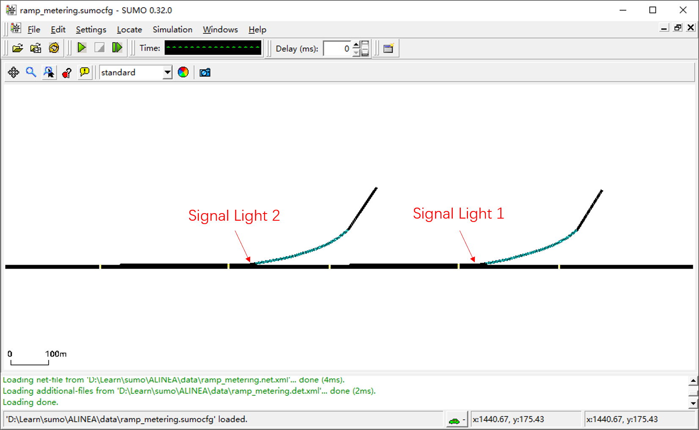
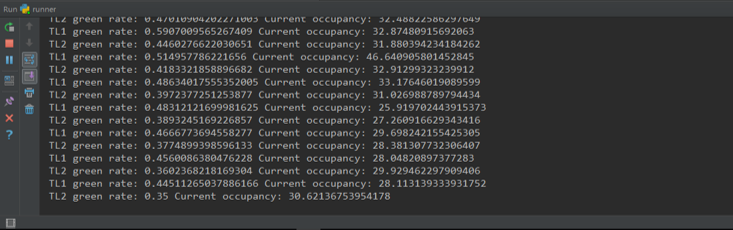
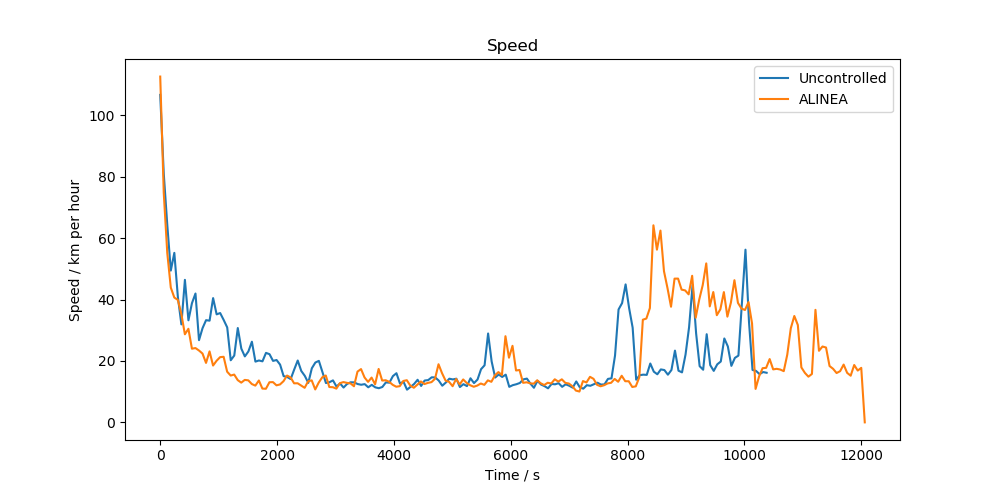

# 概述
本节介绍如何通过SUMO和TraCI实现基于ALINEA算法的匝道自适应控制。

# 建立路网
建立包括一段快速路和两个入口匝道的路网，快速路主线为3车道，匝道为2车道，入口匝道与主线交汇后设置300米左右的加速车道，即主线增加一个车道。快速路最上游和入口匝道的起点处，接两端100米左右的起始路段。在匝道与快速路主线的交汇处各设置一个信号灯，信号灯相位可以设置只保留一个相位"GGGGG"，周期任意指定，即初始状态匝道信号灯始终为绿灯。路网形式类似于下图：



# 设置检测器
建立文件`ramp_metering.det.xml`，并写入以下内容：
```xml
<additional>
	<inductionLoop id="D1_0" lane="edge1_0" pos="50" freq="60" file="ramp_metering.out" friendlyPos="x"/>
	<inductionLoop id="D1_1" lane="edge1_1" pos="50" freq="60" file="ramp_metering.out" friendlyPos="x"/>
	<inductionLoop id="D1_2" lane="edge1_2" pos="50" freq="60" file="ramp_metering.out" friendlyPos="x"/>
	<inductionLoop id="D2_0" lane="edge2_0" pos="50" freq="60" file="ramp_metering.out" friendlyPos="x"/>
	<inductionLoop id="D2_1" lane="edge2_1" pos="50" freq="60" file="ramp_metering.out" friendlyPos="x"/>
	<inductionLoop id="D2_2" lane="edge2_2" pos="50" freq="60" file="ramp_metering.out" friendlyPos="x"/>
	<inductionLoop id="D2_3" lane="edge2_3" pos="50" freq="60" file="ramp_metering.out" friendlyPos="x"/>
	<inductionLoop id="D3_0" lane="edge3_0" pos="50" freq="60" file="ramp_metering.out" friendlyPos="x"/>
	<inductionLoop id="D3_1" lane="edge3_1" pos="50" freq="60" file="ramp_metering.out" friendlyPos="x"/>
	<inductionLoop id="D3_2" lane="edge3_2" pos="50" freq="60" file="ramp_metering.out" friendlyPos="x"/>
	<inductionLoop id="D4_0" lane="edge4_0" pos="50" freq="60" file="ramp_metering.out" friendlyPos="x"/>
	<inductionLoop id="D4_1" lane="edge4_1" pos="50" freq="60" file="ramp_metering.out" friendlyPos="x"/>
	<inductionLoop id="D4_2" lane="edge4_2" pos="50" freq="60" file="ramp_metering.out" friendlyPos="x"/>
	<inductionLoop id="D4_3" lane="edge4_3" pos="50" freq="60" file="ramp_metering.out" friendlyPos="x"/>
	<inductionLoop id="D5_0" lane="edge5_0" pos="50" freq="60" file="ramp_metering.out" friendlyPos="x"/>
	<inductionLoop id="D5_1" lane="edge5_1" pos="50" freq="60" file="ramp_metering.out" friendlyPos="x"/>
	<inductionLoop id="D5_2" lane="edge5_2" pos="50" freq="60" file="ramp_metering.out" friendlyPos="x"/>
	<laneAreaDetector id="R1_0" lane="ramp1_0" pos="0" endPos="-1" freq="600" file="ramp_metering.out"/>
	<laneAreaDetector id="R1_1" lane="ramp1_1" pos="0" endPos="-1" freq="600" file="ramp_metering.out"/>
	<laneAreaDetector id="R2_0" lane="ramp2_0" pos="0" endPos="-1" freq="600" file="ramp_metering.out"/>
	<laneAreaDetector id="R2_1" lane="ramp2_1" pos="0" endPos="-1" freq="600" file="ramp_metering.out"/>
</additional>
```
这里，我们创建了两种检测器，一种是单点检测器，用于获取单点的速度、流量、占有率观测值；另一种是车道范围的检测器，可以检测车道范围的速度、流量、占有率，也可以获得排队长度等信息。车道范围检测器在本例中未被使用，但是在考虑排队长度的信控仿真中非常有用。

单点检测器放置在距离匝道与主线交汇处50-100米的位置，被应用于本例的自适应控制中。

# 定义路由
建立文件`ramp_metering.rou.xml`，定义车辆类型，并采用与上一节相同的方法创建时变流量：
```python
rh.createSinFlow('main', 'car', "input_main", "edge5", 0, 7200, 20, 2000, 3000)
rh.createSinFlow('a', 'car', "input_ramp1", "edge5", 0, 7200, 20, 1000, 1500)
rh.createSinFlow('b', 'car', "input_ramp2", "edge5", 0, 7200, 20, 1000, 1500)
```

# 检测线圈数据记录器
与上节不同的是，我们不能等到仿真结束时再去获取仿真结果，而是需要在仿真过程中实时获取检测数据以用于自适应控制。我们新建一个`DetectorRecorder`类来帮助我们记录仿真数据。类定义如下：
```python
class DetectorRecorder(object):
    def __init__(self, detector_type, data_type, integration_frequency, detector_prefix, lane_number):
        self.detector_type = detector_type
        self.data_type = data_type
        self.integration_frequency = integration_frequency
        self.integrated_data = []
        self._step = 0
        self._cycle = 0
        self.detector_prefix = detector_prefix
        self.lane_number = lane_number
        self.data = []

    def recordData(self):
        """Record data"""

    def getIntegratedData(self):
        """Get integrated data"""

    def getLastIntegratedData(self):
        """Get the last integrated data"""

    def getAveragedData(self):
        """Get the averaged integrated data"""

    def integratedDataAppend(self):
        """If the integrated data is updated, return True"""

    def plotData(self):
        """Visualize the integrated data"""

    @ property
    def step(self):
        return self._step

    @ property
    def cycle(self):
        return self._cycle
```
简明起见，这里不给出全部代码，完整代码参见相应的Git仓库（将很快放出）。

# 信号控制逻辑
我们定义一个`SignalLight`类，来处理关于信号控制的各种事务。其中的各个方法介绍如下：
* `bingdingDetectors`：用于将信号灯与检测线圈数据记录器对象绑定起来；
* `updateLogic`：用于更新信号控制逻辑（SUMO有提供了一套独特的方法来定义信号控制逻辑，注意其定义方式）；
* `controller`：控制器，这里需要编写信号控制算法；
* `getGreenRates`：获取绿信比记录；
* `getLastGreenRate`：获取上个控制周期的绿信比。

```python
class SignalLight(object):
    def __init__(self, name):
        self.name = name
        self.detectors = None
        self.control_period = 60
        self.green_rate = 0.5
        self.green_rate_recorder = []

    def bindingDetectors(self, detectors):
        # "detectors" is a detector object dict like {'detector1': detector object 1, 'detector2': detector object 2}
        self.detectors = detectors

    def updateLogic(self, logic):
        """Update signal timing logic"""
        # Logic is a list like [[50, "GGGGG"], [10, "rrGGG"]]
        phases = []
        for i in range(len(logic)):
            phases.append(traci.trafficlights.Phase(logic[i][0], 0, 0, logic[i][1]))
        logic = traci.trafficlights.Logic(self.name, 0, 0, 0, phases)
        traci.trafficlights.setCompleteRedYellowGreenDefinition(self.name, logic)

    def controller(self, occupancy_cr, KR):
        """The method need to be updated when we want to change timing algorithms"""
        # Now the ALINEA ramp metering algorithm is adopted
        self.green_rate = self.green_rate + KR * (occupancy_cr - self.detectors['occupancy'].getLastIntegratedData()/100)
        if self.green_rate > 0.7:
            self.green_rate = 0.7
        elif self.green_rate < 0.35:
            self.green_rate = 0.35
        self.green_rate_recorder.append(self.green_rate)
        logic = [[int(self.control_period * self.green_rate), "GGGGG"],
                 [int(self.control_period * (1 - self.green_rate)), "rrGGG"]]
        self.updateLogic(logic)

    def getGreenRates(self):
        return self.green_rate_recorder

    def getLastGreenRate(self):
        return self.green_rate
```

ALINEA算法的控制逻辑是通过下面的语句定义的：
```python
self.green_rate = self.green_rate + KR * (occupancy_cr - self.detectors['occupancy'].getLastIntegratedData()/100)
```
其包含两个固定参数：控制增益`KR`和目标占有率`occupancy_cr`，依赖下游的实时占有率检测数据作为控制输入。

# 仿真测试
通过TraCI调用SUMO或SUMO-GUI进行仿真。随着仿真的进行，匝道控制率将会随着交通状况的改变而发生变化，实现自适应控制：



仿真测试结果发现，当主线交通流未饱和而匝道流量较大时，ALINEA算法可以实现较优的控制效果：



后续可考虑引入匝道排队长度作为控制输入，避免排队蔓延造成对地面交通的影响。
